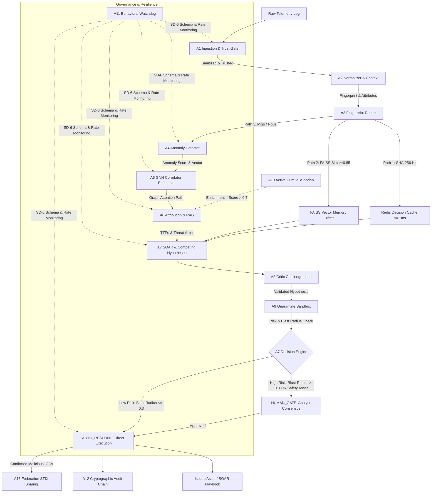

# 🛡️ HCI-OS — Technical Architecture & Pipeline Specification
## Hypothesis-Driven Cyber Investigation Operating System v3.3

HCI-OS organizes cyber security operations into **12 interconnected layers** orchestrated by **13 specialized AI agents (A1–A13)**. Departing from traditional, rule-based static alert matching, HCI-OS represents enterprise threats as dynamic, evolving subgraphs and competing Bayesian hypotheses, protected by a **9-layer self-defense framework (SD-0 to SD-8)**.

---

## 📐 System Architecture Diagram



---

## 1. Core Data Objects

The system shares state across all layers using three strongly-typed Pydantic schemas:

```
[Evidence] (Canonical telemetry & 256-dim behavior embedding)
    │
    ▼
[Hypothesis] (Bayesian competing explanations & decaying confidence)
    │
    ▼
[Decision] (Cryptographically signed, hash-chained containment playbooks)
```

1. **Evidence (`Evidence`):** Normalized representation of raw logs (web access logs, CICIDS network flows, Windows events, OT SCADA protocols). Features a SHA-256 `content_fingerprint`, standardized entity extraction (IPs, users, process IDs, hashes), and a 256-dimensional semantic behavior embedding vector.
2. **Hypothesis (`Hypothesis`):** Represents competing explanations for observed behavior ($H_1$: APT41 Compromise vs $H_2$: Authorized Admin Access). Calculates Bayesian probability updates:
   $$P(H_i|E) = \frac{P(E|H_i) \cdot P(H_i)}{\sum_j P(E|H_j) \cdot P(H_j)}$$
   Applies temporal decay to stale evidence over time:
   $$C_{\text{decayed}} = C_{\text{initial}} \cdot e^{-\lambda \cdot t_{\text{hours}}}$$
3. **Decision (`Decision`):** Versioned, cryptographically chained containment playbooks (e.g. `ISOLATE_HOST`, `BLOCK_IP`, `REVOKE_SESSION`). Each decision calculates an `audit_hash` derived from the previous entry's `audit_chain_prev`, creating a tamper-evident audit log.

---

## 2. The Three Processing Paths

HCI-OS routes inbound telemetry through three distinct paths to balance latency, cost, and analytical depth:

```
                  [ Ingested Telemetry ]
                            │
        ┌───────────────────┼───────────────────┐
        ▼                   ▼                   ▼
   [ Fast Path ]     [ Accelerated ]     [ Full Loop ]
     Redis Cache       FAISS Vector        GNN + RAG + SOAR
      < 0.1ms             ~16ms               1.5 - 5s
```

1. **Exact Match (Path 1 — Fast Path):**
   - **Trigger:** SHA-256 `content_fingerprint` match in Redis threat cache.
   - **Performance:** `< 0.1 ms`. Instantly executes or reuses past verified containment actions, saving ~80% compute.
2. **Fuzzy / Semantic Match (Path 2 — Accelerated Path):**
   - **Trigger:** Cosine similarity match ($\ge 0.85$) against FAISS behavior embedding index.
   - **Performance:** `~16 ms`. Reuses historical critic verdicts while scaling confidence by 0.95.
3. **Hypothesis Loop (Path 3 — Full Novel Pipeline):**
   - **Trigger:** Unseen or novel behavior logs failing cache matches.
   - **Performance:** `1.5 - 5.0 seconds`. Executes full GNN correlation, FAISS RAG threat attribution, Critic validation, and Human Gate evaluation.

---

## 3. The 13 Agents Specification (A1–A13)

| Agent ID | Agent Name | Core Responsibilities | Technology & Algorithms |
| :--- | :--- | :--- | :--- |
| **A1** | Ingestion & Trust | SD-0 input sanitization (7 regex patterns) & SD-1 trust scoring. Routes unknown sources to `quarantine.jsonl`. | Regex Sanitizer + Trust Matrix |
| **A2** | Normalizer & Context | Field mapping across 5 source types. Binds Indian context (holidays/elections) and OT device safety metadata (`can_reboot`). | Pydantic v2 + Asset JSON Lookup |
| **A3** | Fingerprint Router | Evaluates incoming events against Redis (Path 1) and FAISS (Path 2); routes novel events to Path 3. | Redis + FAISS Cosine Index |
| **A4** | Anomaly Detector | Tabular & temporal anomaly scoring. Generates 256-dim behavior embeddings and calculates epistemic uncertainty. | Isolation Forest + Welford Z-Score |
| **A5** | GNN Correlator | Builds dynamic subgraphs and calculates attack propagation probabilities using PyTorch model fusion. | Vectorized GAT + GraphSAGE + TGN |
| **A6** | Attribution & RAG | Queries MITRE ATT&CK, NVD CVEs, and CERT-In advisories via FAISS RAG to map threat actors and next moves. | FAISS Vector Store + Groq Llama 3.1 |
| **A7** | SOAR & Planner | Computes BFS blast radius, updates Bayesian competing hypotheses, collects counter-evidence, and triggers decisions. | BFS Graph Traversal + ACH Bayesian |
| **A8** | Critic / Skeptic | Adversarial challenger agent testing hypotheses for false-positive logic and business disruption risks. | Adversarial LLM Prompting |
| **A9** | Quarantine Verifier | Dual-agent execution sandbox validating proposed scripts/actions prior to deployment. | Dual-Agent Execution Sandbox |
| **A10** | Active Hunt | Triggered when anomaly score > 0.7 to query VirusTotal and Shodan feeds with rate-limiting and circuit breakers. | VirusTotal v3 API + Shodan Client |
| **A11** | Behavioral Watchdog | Governance wrapper enforcing agent output schemas, rate limits, and forbidden path access (SD-6). | Sliding Queue + Profile Validator |
| **A12** | Audit & Memory | Maintains immutable SHA-256 chained log (`audit_log.jsonl`), manages cognitive memory, and evaluates reviewer consensus. | SHA-256 Cryptographic Chaining |
| **A13** | Federation | Anonymizes confirmed malicious indicators and publishes STIX 2.1 STIX bundles to peer organizations. | STIX 2.1 Indicator Exporter |

---

## 4. GNN Ensemble Architecture (A5)

The GNN Correlator fuses three complementary PyTorch models to evaluate topology and temporal movement:

1. **GAT (Graph Attention Network):** Uses multi-head attention (`models/gat.py`) to compute dynamic attention weights between interconnected network assets, highlighting lateral movement paths. Optimized using PyTorch `index_add_` vectorization to achieve **0.05s per epoch** training speed (400x speedup).
2. **GraphSAGE:** Performs inductive neighborhood aggregation (`models/graphsage.py`) to classify unseen nodes as *Compromised* or *Clean*. Trained with class-weighted cross-entropy (`F.nll_loss` ~313:1 weight) to handle severe class imbalance (16 attack nodes vs 5,010 normal nodes), achieving **100% Test Recall**.
3. **TGN (Temporal Graph Network):** Incorporates dynamic node memory (`models/tgn.py`) with a GRU updater and time-decay positional encodings to detect slow, multi-day lateral pivots. During baseline telemetry, it maintains a **0.00% False Positive Rate**.

**Ensemble Fusion Score:**
$$\text{Score}_{\text{fused}} = 0.4 \cdot \text{Score}_{\text{GAT}} + 0.3 \cdot \text{Score}_{\text{TGN}} + 0.3 \cdot \text{Score}_{\text{GraphSAGE}}$$

---

## 5. Safety & Governance Engine (A7 & Human Gate)

To prevent automated mitigations from disrupting critical infrastructure (e.g. power grids, medical centers, railway signaling):

```
                   [ A7 Risk & Blast Radius Evaluation ]
                                     │
                ┌────────────────────┴────────────────────┐
                ▼                                         ▼
      (Blast Radius ≤ 0.3)                       (Blast Radius > 0.3)
      AND can_reboot = True                      OR safety_critical = True
                │                                         │
                ▼                                         ▼
      ⚡ AUTO_RESPOND                            🚨 HUMAN_GATE
     (Direct Execution)                      (Pending Analyst Review)
                │                                         │
                ▼                                         ▼
         Execute Playbook                        Trust-Weighted Vote
                                                 (CISO: 0.9, Sr: 0.9)
                                                          │
                                             ┌────────────┴────────────┐
                                             ▼                         ▼
                                      (Vote ≥ 0.70)             (Vote < 0.70)
                                             │                         │
                                             ▼                         ▼
                                         Approved                  Rejected
```

- **Blast Radius Calculation:** Uses Breadth-First Search (BFS) over asset graph adjacency lists:
  $$\text{BlastRadius} = \min\left(1.0, \sum_{\text{reachable}} \text{Criticality} \times \text{Reachability} \times P_{\text{prop}}\right)$$
- **Reviewer Consensus:** High-impact operations require a weighted consensus score $\ge 0.70$ (CISO: 0.90, Senior Analyst: 0.90, Junior Analyst: 0.30) before execution.

---

## 6. Built-in Self-Defense Framework (SD-0 to SD-8)

| Layer | Control Name | Mechanism |
| :--- | :--- | :--- |
| **SD-0** | Input Sanitizer | Scans raw logs for 7 injection patterns (JNDI `${jndi:`, SQLi `UNION SELECT`, XSS `<script>`, Path Traversal `../`, hidden Unicode). |
| **SD-1** | Source Trust Gate | Validates origin signatures (CERT-In: 0.95, Internal: 0.70). Trust score = 0 routes to quarantine. |
| **SD-2** | Dual-LLM Sandbox | Uses heuristic prompts to verify secondary LLM responses against jailbreaks and prompt leakage. |
| **SD-3** | Resource Guardian | Wraps external calls in 30s timeouts and a circuit breaker (trips after 3 failures for 60s). |
| **SD-4** | Write Authorization | Uses Python runtime stack inspection to enforce deny-by-default file write access per agent. |
| **SD-5** | Output Judge | Mandatory gate screening outgoing payloads for AWS keys (`AKIA...`), passwords, PII, and credentials. |
| **SD-6** | Behavioral Watchdog | A11 executes wrapper schema validations & sliding rate limit queues on all agent calls. |
| **SD-7** | Forensic Rejection Log | Cryptographically chained `sd_log.jsonl` with automatic startup verification health checks. |
| **SD-8** | Kill Switch / Freeze | Emergency `/emergency-stop` endpoint allowing authorized roles (CISO/sysadmin) to freeze all autonomy instantly. |

---

## 7. Automated CERT-In 6-Hour Compliance Reporting

Under Section 70B of the Indian Information Technology Act, organizations must report cyber incidents to **CERT-In within 6 hours**.

- **Synchronized SLA Countdown:** Live React custom hook (`useCountdown.js`) calculates remaining time from `detection_ts` and `Date.now()`, capping the timer strictly between `00:00:00` and `06:00:00`. Stripping timezone offsets guarantees wall-clock precision across page reloads.
- **Dynamic PDF/Markdown Exporter:** `reports/exporter.py` automatically binds contact details, organization types, sector checkboxes, impacted asset tables, attacker IP IOCs, and executed mitigation actions directly from the live incident state into formatted official PDFs.

---

*HCI-OS Technical Architecture Specification v3.3 — ET AI Hackathon 2026*
